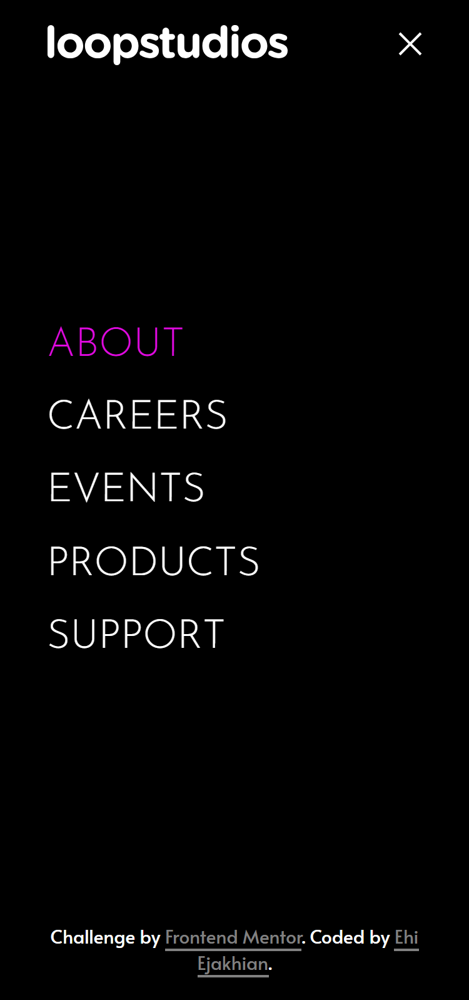

# Frontend Mentor - Loopstudios landing page solution

Hey there!. This is my solution to the [Loopstudios landing page challenge on Frontend Mentor](https://www.frontendmentor.io/challenges/loopstudios-landing-page-N88J5Onjw). Frontend Mentor challenges help you improve your coding skills by building realistic projects. 

## Table of contents
- [Me](#meet-me)
- [Overview](#overview)
  - [The challenge](#the-challenge)
  - [Screenshot](#screenshot)
  - [Links](#links)
- [My process](#my-process)
  - [Built with](#built-with)
  - [What I learned](#what-i-learned)
  - [Continued development](#continued-development)
  - [Useful resources](#useful-resources)
- [Acknowledgments](#acknowledgments)
- [Author](#author)
- [Thanks](#thanks)

## Meet Me
Good day. I'm Ehi. I'm an aspiring developer from Edo, Nigeria. I took this challenge. Here's how I did it and thanks for reading!

**[More on me](https://ehiejakhian.github.io/)**

## Overview

### The challenge

Users should be able to:

- View the optimal layout for the site depending on their device's screen size
- See hover states for all interactive elements on the page

### Screenshot

I know, It doesn't match it very much, or even at all. I gave it my all though.

### Links

- Solution URL: [Frontend-Mentor-Loopstudios-Landing-page Solution By Ehi Ejakhian](https://github.com/Ehiejakhian/Frontend-Mentor-Loopstudios-landing-page)
- Live Site URL: [Frontend-Mentor-Loopstudios-Landing-page By Ehi Ejakhian](https://ehiejakhian.github.io/Frontend-Mentor-Loopstudios-Landing-page/)

## My process
I started this one by opening the design images in GIMP (GNU Image Manipulation Program). I measure the paddings, gutters (gaps) and sizes of responsive elements. These help me create responsive functions and mixins. Then, I write my HTML, and give class names using BEM which I recently learned. I use SCSS to create my styling so BEM makes it easier.

After my HTML, I start styling with padding. I set the margin of all elements to zero and then give all elements borders. This helps me visualize all element boundaries - all this I do without adding any color.

Then, I add color, backgrounds and border radii to the assigned elements. I prefer using Comic Sans MS and or Outfit as my font because they feel relaxing to my eyes and help me think better. I can't explain it though, it's just a feeling.

Weird, right?😁

### Built with

- Semantic HTML5 markup
- SCSS
- Flexbox
- CSS Grid
- Mobile-first workflow
- **No Javascript**

### What I learned

Yep. No Javascript. I used labels and checkboxes to do that thanks to **[Codin2Go's Responsive Navbar- CSS only solution](https://youtu.be/8eFeIFKAKHw?si=GzljC16g9cEAOXLY)** video. 

Also, for the first time, I was brave enough to use the **`calc()`** function. Yep, I was scared to use it beause I didn't really understand how it works but **[MDN Web Docs](https://developer.mozilla.org/en-US/docs/Web/CSS/calc)** had all I needed to start using it. Also once you get to understand it, it replaces the need to use the **`clamp()`** function at times. Yep, that's most of it!

### Continued development

I would love to get the design better next time.

### Useful resources

- [Coding2Go's "Create a Responsize navbar - a CSS only solution"](https://youtu.be/8eFeIFKAKHw?si=GzljC16g9cEAOXLY) - This is an amazing video that I'll recommend to all out there who want to use only CSS to create nav-bars and make their lives simpler.

## Acknowledgments

I want to thank everyone out there who takes their time to put out useful coding tips and info out on the web for all to use for free and paid. Thank you. For those of us from otherwise poor vicinities, you help make our dreams come true.

## Author
Let's gist!
- Website portfiolo - [Ehi Ejakhian](https://ehiejakhian.github.io/)
- Frontend Mentor - [@EhiEjakhian](https://www.frontendmentor.io/profile/EhiEjakhian)
- Chat me on Whatsapp - [Ehi Ejakhian](https://wa.me/+2348142340182?text=Hello%20Ehi%20.%20I%20checked%20your%20Frontend-Mentor-Loopstudios-Landing-page/%20solution)
- LinkedIn - [Ejakhian Ehi](https://ng.linkedin.com/in/ehi-ejakhian-2302a7318)

I'm also an aspiring comic and sketch artist, so if you have any gigs or if you can relate, check me up on whatsapp and see my art.

# Thanks!
Thank you for going through this. I really hope I did good to your taste, if not please tell me how to improve on the comments section of my solution. Thanks again!